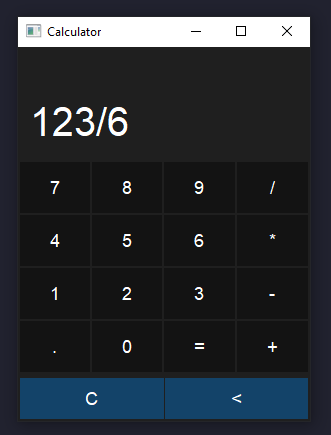

# Simple PyQt5 Calculator

## Description
A basic calculator application built with PyQt5. It supports standard arithmetic operations (addition, subtraction, multiplication, division) and includes clear (C) and backspace (<) functionality.



## Features
- Clean, dark-themed interface
- Responsive button design with hover effects
- Basic arithmetic operations
- Error handling for invalid expressions

## Requirements
- Python 3.x
- PyQt5

## Installation
1. Ensure you have Python installed
2. Install PyQt5:
   ```
   pip install PyQt5
   ```

## Usage
Run the script:
```
python calculator.py
```

Click the buttons to perform calculations:
- Use number buttons (0-9) and operators (+, -, *, /) to enter expressions
- Press "=" to calculate the result
- "C" clears the display
- "<" removes the last character

## License
Free to use and modify 
